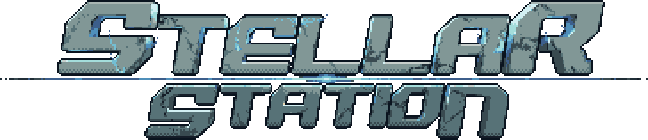

  

[//]: # ([![Discord]&#40;https://img.shields.io/discord/1272545509562777621?label=Discord&logo=discord&logoColor=white&#41;]&#40;https://discord.gg/ssJTANEa&#41;)

[//]: # ([![GitHub]&#40;https://img.shields.io/github/stars/ss14Starlight/space-station-14?style=social&#41;]&#40;[https://github.com/ss14Starlight/space-station-14]&#41;)

---

## Licenses

> [!WARNING]
> The Stellar Station codebase contains files that are **All Rights Reserved**.
>
> Unless files or the folders containing them are explicitly labeled otherwise, you should treat files as **All Rights Reserved**.
>> Inquiry regarding the license status of specific files in this repository may be made in the Stellar Station Discord.
> Please be aware that files may be re-licensed to more permissive licenses in the future by their license holders.
> and that the usage of All Rights Reserved in this codebase is not expected to be perpetual.

>Many files are considered [All Rights Reserved](https://en.wikipedia.org/wiki/All_rights_reserved).

>Many files are licensed under [MIT license](https://opensource.org/license/MIT).

>Many files are licensed under [Creative Commons 3.0 BY-SA](https://creativecommons.org/licenses/by-sa/3.0/).

>Some files are licensed under [Creative Commons 3.0 BY-NC-SA](https://creativecommons.org/licenses/by-nc-sa/3.0/).

## Contribution

Stellar Station is currently under closed development. Contributions may be made by approved contributors.

---
## AI-generated contributions disclaimer
This project does not accept AI-generated contributions. Examples include, but are not limited to:

- Any code (including yaml) generated by tools like GitHub Copilot, ChatGPT, or similar.
- Auto-generated documentation, issue reports or pull request descriptions.
- AI-created artwork, sound files, or other assets.

Exceptions to this are simple tools like Rider's single-line completion feature.
